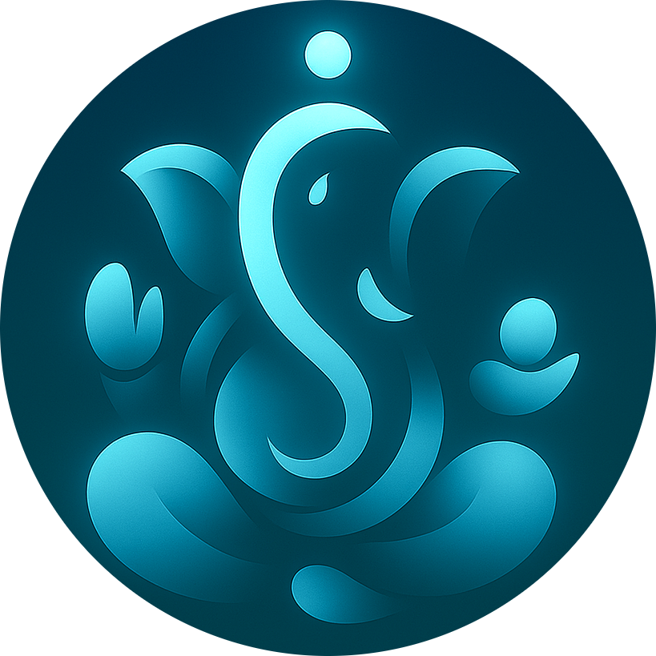

<p align="center">
  
</p>

<p align="center">
         ॐ गणेशाय नमः 
  
    वक्रतुण्ड महाकाय सूर्यकोटि समप्रभ  
    निर्विघ्नं कुरु मे देव सर्वकार्येषु सर्वदा॥
</p>

<p>
   Project's श्लोक
   
    धर्मार्थकाममोक्षाणां आरोग्यं मूलमुत्तमम्।
    रोगस्तस्यापहर्ता च तस्मात् रोगं विवर्जयेत्॥

    स्वास्थ्य ही जीवन के चारों पुरुषार्थों की आधारशिला है।
    रोग उसका मौन शत्रु है — जिसे हर साधक को हराना चाहिए।
</p>


---

# Saadhna AI and Saadho AI

Saadhna is a dual-purpose healthcare and wellness AI system built for two distinct yet connected needs:

---

## 1. Doctor Assistant – Saadhna AI

Saadhna AI acts as a thoughtful assistant to doctors, patients, and medical students.
It interprets prescriptions, explains medicines, and answers questions with clarity and empathy.
It is made highly focussed for patients acts as your personal ai doctor via offering aayurvedic and scientific ways to help.

### Features:
- Upload your handwritten prescription for instant decoding
- Upload your handwritten prescription for instant decoding
- Explains every medicine, dosage, purpose, and when to take it (before/after meals)
- Gives Scientific and Aayurvedic suggestion of food to take it or not
- Offers combined insights from allopathy and ayurveda
- Supports follow-up health questions with emotional tone
- Summarizes the patient’s issue in one line for fast referencing

---

## 2. Mental Wellness Support – Saadho AI

Saadho AI is your personal mental wellness companion. It listens, guides, and supports your inner emotional health without any judgment.

### Features:
- Offers motivation during stress, anxiety, or overthinking
- Listens and responds in a calm, therapeutic tone
- Encourages mindfulness, gratitude, and inner healing
- Remembers emotional context and builds upon user journey
- Designed to be gentle, helpful, and grounded in compassion

---

## Prescription Upload

- Upload scanned prescriptions (image input)
- Saadhna reads and breaks it into simple bullet points
- Accurate decoding of handwriting, timings, and medicines
- Suggests dietary & lifestyle recommendations when needed

---

## Medicine Finder (Coming Soon)

- Upload image or text of any medicine
- AI will check availability across known pharmacy APIs
- Location-aware search (optional)
- Works for generic and rare medicines alike

---

## Technology Stack

- Frontend: Next.js (Client Components)
- Backend: Google Gemini API (via `@google/genai`)
- Auth: Clerk
- Database: MongoDB (Mongoose)
- Image Uploads: FormData (with Gemini's vision model)
- Chat History: Persisted per-user in MongoDB
- Summary Extraction: Every AI response includes a short summary

---

```
Saadhna AI – Project Structure

/
├── app/
│   ├── api/
│   │   ├── chats/
│   │   │   ├── [id]/
│   │   │   │   └── messages/
│   │   │   └── messages/
│   │   └── config/
│   │       ├── gemini/
│   │       └── saadhna/
│   ├── pages/
│   ├── components/
│   ├── all routes/
│   └── clerk/
│
├── lib/
│   └── db.js
│
├── models/
│   ├── Message.js
│   ├── Chat.js
│   └── Summary.js
│
├── public/
│   └── all images
│
├── .env.local
├── package.json
└── README.md
```


---

## Setup

1. Clone the repo
2. Install dependencies  
   `npm install`
3. Setup `.env.local` with:
`MONGODB_URI=your-mongodb-uri
GEMINI_API_KEY=your-gemini-api-key`

4. Run dev server  
`npm run dev`

---

## Summary Format

- Every AI response ends with a summary in this format:  
`[[summary: user has diabetes and taking xyz meds]]`
- Summary is extracted and stored with the chat
- Helps AI maintain user's long-term context

---

## License

For personal, educational and research use only. Not a substitute for licensed medical advice.
